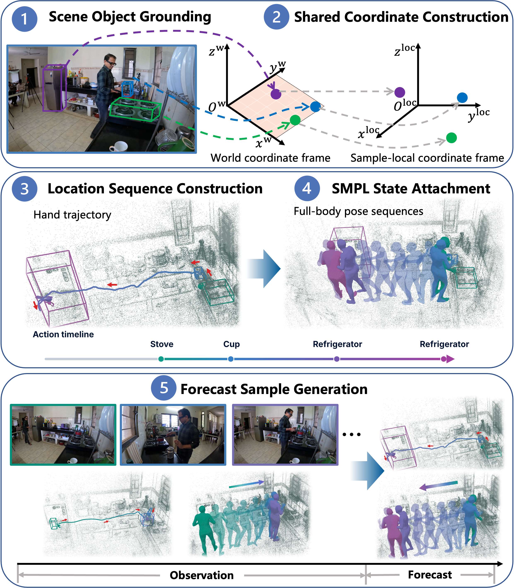

# Data preparation

Construct Coherent4D from [Ego-Exo4D](https://docs.ego-exo4d-data.org/getting-started/) using the steps below.



## 1. Scene object grounding

Use [Detic](https://github.com/facebookresearch/Detic) and SLAM geometry to associate semantic labels with 3D object boxes and obtain `<take_name>_object_bbs_obb.pkl`. See [scene object grounding](01_scene_object_grounding/) for the tools and input/output files.

## 2. Shared coordinate construction

Define a [shared local frame](02_shared_coordinate_construction/) from device poses near the source observation endpoint. Transform hand locations, object geometry, and full-body states with the same origin and axes; normalize hand locations and object centers/sizes while retaining metric pose translations and joints.

## 3. Location sequence construction

Use [Llama 3](https://github.com/meta-llama/llama3) to match narrated interactions with FIction's `InteractionFromNarration/llama3.py` and `parse_outputs.py`. Combine these outputs with reconstructed poses and grounded objects using `PuttingEverythingIn3D/main.py`, then run [`build_interactions.py`](03_location_sequence_construction/) to construct shared-frame hand-location sequences, merge repeated interactions, and save `*_F0norm.pkl`.

## 4. SMPL state attachment

Use [WHAM](https://github.com/yohanshin/WHAM) to reconstruct SMPL poses and select the actor with `find_actor_from_outputs_largest_area.py` to obtain `<take_name>_largest_area.pkl`. [`attach_smpl.py`](04_smpl_state_attachment/) pairs each retained timestamp with SMPL rotations, metric root translations, 19 joint positions, and a pose-validity mask in the shared local frame. The script takes location chunks generated by the next stage.

## 5. Forecast sample generation

Run [`build_chunks.py`](05_forecast_sample_generation/) to form sequences of 10 events for Cooking, 5 for Health, or 4 for Bike Repair. Each chunk retains its observation history, absolute/relative timestamps, and padding mask, then receives full-body states through SMPL attachment.

## Run

Use Python 3.9 and install the dependencies from the repository root:

```bash
python -m pip install -r process/requirements.txt
```

The five stages above follow the diagram; the linked folders provide commands and input paths. Script execution order is `build_interactions.py` → `build_chunks.py` → `attach_smpl.py` (stages 3 → 5 → 4).
